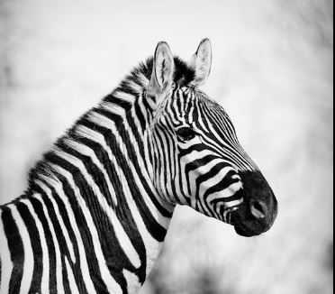
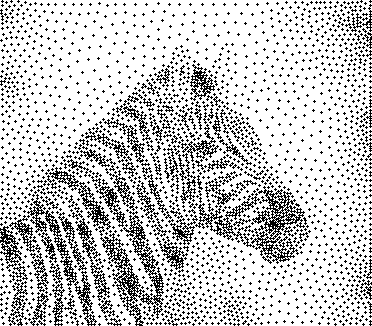

# CUDA Image Stippling

Image stippling using weighted Lloyd relaxation with multiple implementations for performance comparison.

Implemented versions:

* CPU Baseline
* Naive CUDA
* Shared Memory Tiled CUDA
* Jump Flooding Algorithm (JFA) CUDA

The project generates stippled representations of images by distributing points according to image density and iteratively refining their positions using weighted Voronoi centroids.

---

## Dependencies

This project uses the single-header stb image libraries:

```text
stb_image.h
stb_image_write.h
```

Download both files from the stb repository and place them in the same directory as the source files.

---

## Building

### CPU Baseline

```bash
g++ -O2 cpu_baseline.cpp -o stippling_cpu
```

### Naive CUDA

```bash
nvcc -O2 cuda_naive.cu -o stippling_cuda_naive
```

### Shared Memory Tiled CUDA

```bash
nvcc -O2 cuda_tiled.cu -o stippling_cuda_tiled
```

### JFA CUDA

```bash
nvcc -O2 cuda_jfa.cu -o stippling_cuda_jfa
```

---

## Usage

CPU:

```bash
./stippling_cpu input.png output.png 5000 25 1.0 1
```

Naive CUDA:

```bash
./stippling_cuda_naive input.png output.png 5000 25 1.0 1 256
```

Shared Memory Tiled CUDA:

```bash
./stippling_cuda_tiled input.png output.png 5000 25 1.0 1 256
```

JFA CUDA:

```bash
./stippling_cuda_jfa input.png output.png 5000 25 1.0 1 256
```

---

## Parameters

### Required Parameters

| Parameter      | Description                |
| -------------- | -------------------------- |
| `input_image`  | Input image path           |
| `output_image` | Output image path          |
| `num_points`   | Number of stipple points   |
| `iterations`   | Number of Lloyd iterations |

### Optional Parameters

| Parameter    | Default | Description                     |
| ------------ | ------- | ------------------------------- |
| `gamma`      | `1.0`   | Density mapping exponent        |
| `dot_radius` | `1`     | Radius of rendered stipple dots |
| `block_size` | `256`   | CUDA thread block size          |

---

## Results

### Example Input



### Example Output



---

## Notes

* Darker image regions receive higher point density.
* Point positions are refined using weighted Lloyd relaxation.
* Timing information is reported for the major stages of each implementation.
* The project is intended for comparing different approaches to the assignment stage of weighted Voronoi stippling.
